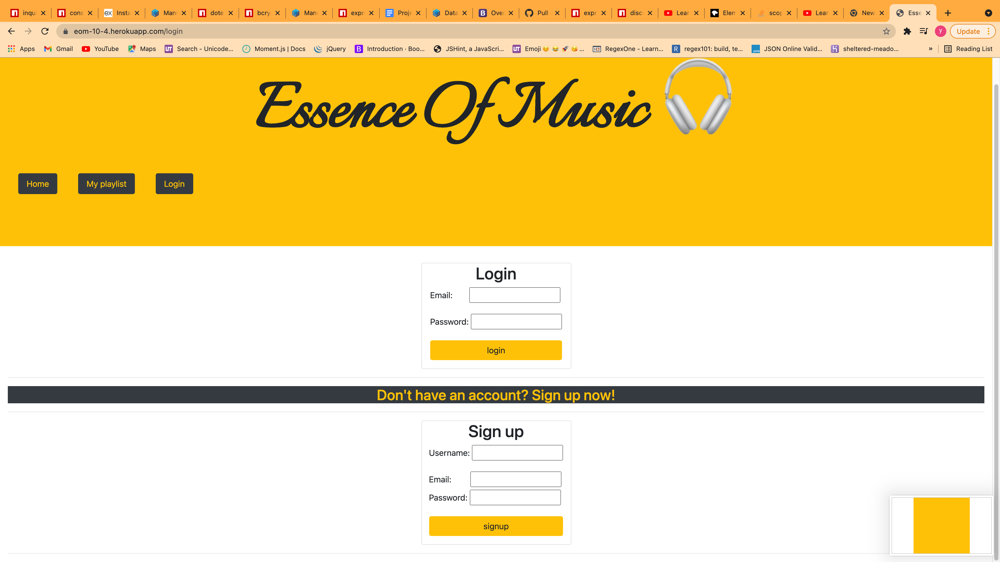
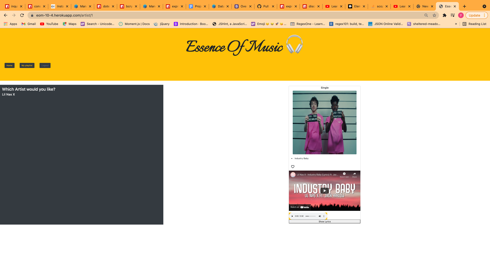
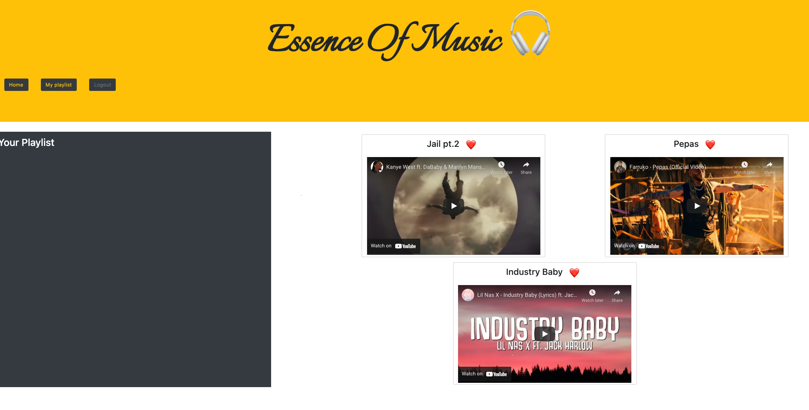

# Essence_Of_Music

### [Live Website/ Deployed link](https://eom-10-4.herokuapp.com/login)

## trial account: 
```
   username: test
   password: 1234567890
   email: test@test.com
   ```

## User Story
```
As a music lover
I want to discover more artists in certain genres.
So that I can find songs and albums that fit my taste.
```

## Features
Essence of Music is a responsive and interactive application designed to fill the needs of our Users. We focused on the Users experience, therefore Essence of Music (EOM) includes the following:
- Sign-In capabilities for the users safety of personal information.
- Mobile phone adjustments, for the user on the go!
- A Lyric driven API installation allowing the user to read along, learn the song, and maybe even enjoy some Karaoke.
- Timed logout cookie, for user information protection.

## Usage
The user will be presented with the Essence of Music login page initially. If this is the first time the User is signing in, they will be asked to create a profile. Once the profile is established, they will be presented with our Music Genre page, where they can select from our options of Pop, Country, Hip-Hop, etc.

One the user has selected the genre, they can select an artist, a song, or even a clip of the artist music video. If the User likes the song, click the "like" button to save the song into your My Playlist library. These songs will be saved for when the user logs back into the EOM page.

## Technologies Used
    - Express/Express-Handlebars/Express-Session
    - SequelizeStore/Sequelize ORM
    - Dotenv Configuration
    - MySQL
    - Node.js
    - Lyric API

## Screenshot 







## [Github Repo](https://github.com/yinping-520/Essence_Of_Music)


## Collaborators/Contact
- Yin Ping Gao (yinping.kot@gmail.com)
- Alexis Guzman (ralenadobe@gmail.com)
- Jacquez Patterson (jacquezpatt@gmail.com)
- Thurston Cox (Thurstoncox3@gmail.com)
    
### License
Distributed under the MIT License. See `LICENSE` for more information.
